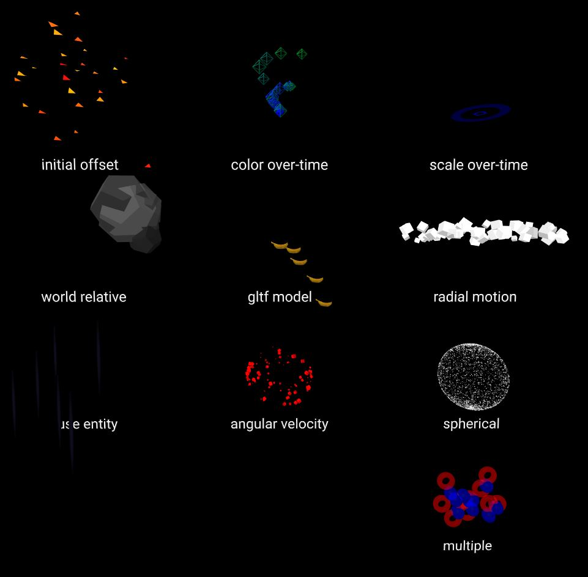

# aframe-mesh-particles-component

The **mesh-particles** component uses shader based geometry instancing to create a set of particles from an entities' mesh geometry.  The particles start spawning once the component is created (and the mesh is available), and will continue until the **duration** expires. Properties can be used to define the position, velocity, acceleration, color, scale and rotation of the particles.

For a demo goto https://harlyq.github.io/aframe-mesh-particles-component/ (banana asset from Poly by Google)



## Examples
```html
<head>
  <script src="https://aframe.io/releases/0.8.2/aframe.min.js"></script>
  <script src="https://unpkg.com/aframe-mesh-particles-component@^0.2.0/aframe-mesh-particles-component.js"></script>
</head>
<body>
  <a-scene>
    <a-gltf-model id="model" src="url(assets/banana/CHAHIN_BANANA.gltf)" scale="0.5 0.5 0.5" visible="false"></a-gltf-model>
    <a-entity position="0 5 -5" mesh-particles="entity: #model; velocity: .1 1 .1; acceleration: 0 -1 0..0 -2 0"></a-entity>
    <a-box color="red" position="0 0 -5" mesh-particles="radialSpeed: 1..2"></a-box>
  </a-scene>
</body>
```

## Values
Some of the properties are listed as type *range*, which is a minimum and maximum value separated by `..` (the system will chose a value within that range for each particle) or just a single value.

Some properties are listed as type *range array*. This provides different values over the life-time of the particle.  The first value is for when the particle is created, linearly interpolating over values, until the last value is reached at the end of the particle's life.  By default there are a maximum of 5 elements for each over-time array, but this can be changed by setting the **overTimeSlots** parameter.

For example:

`lifeTime: 1` - all particles have a life time of 1 (*number range*)

`lifeTime: 2..4` - all particles have a life time between 2 and 4 inclusive (*number range*)

`velocity: 1 1 .1 .. 2 3 5` - velocity value between 1 and 2 for x, 1 and 3 for y, .1 and 5 for z (*vec3 range*)

`scale: 1..2,3,6,.5 .. 1,9` - there are 5 values so each value represents 0%, 25%, 50%, 75% 100% of the particles life time. at 0% scale is between 1 and 2, then blends to 3 at 25%, then up to 6 at 50%, a value between .5 and 1 at 75% then back up to 9 at 100% (*number range[]*)

`rotation: 0 0 0,0 360 0` - there are 2 values, each particle starts at 0 0 0, and linearly interpolates counterclockwise to 0 360 0 (rotation about the Y axis) over the lifetime of the particle (*vec3 range[]*)

## Properties
The list of properties in alphabetical order:

**acceleration** - range for acceleration of each particle in local coordinates (*vec3 range*) default 0 0 0

**angularVelocity** - range for velocity in degrees per second counterclockwise around the local origin about the X, Y and Z axis (*vec3 range*) default 0 0 0

**color** - over-time ranges for the particle color, can use names e.g. `blue` or `color`, or hex strings e.g. `#ff0` or `#e7f890` (*color range array*) default white

**direction** - the direction to play the particle effect. if playing backward the particle will start at the end of its maximum age and then get younger (*forward, backward*) default forward

**duration** - no new particles will be generated after this duration (seconds). if negative, particles are generated forever. changing the duration will restart the particle system (number) defualt -1

**enableInEditor** - if true, the particle system will run while the AFrame Inspector is active (*boolean*) default false

**entity** - entity which contains the geometry for the particle. if no entity is specified use this component's entity (*selector*) default null

**geoName** - object3D name used for the particle geometry (*string*) default mesh

**geoNumber** - each particle is based upon a single mesh, however there may be multiple meshes defined in an object3D. this number determines which mesh to use. 1 for the 1st mesh, 2 for the second etc (*number*) default 1

**lifeTime** - range for maximum age of each particle (*number range*) default 1

**position** - range for offseting the initial particle position in local coordinates (*vec3 range*) default 0 0 0

**opacity** - over-time ranges for the particle opacity. `0` is transparent, `1` is opaque (*number range array*) default 1

**overTimeSlots** - maximum number of slots for over-time attributes. if an attribute has more than **overTimeSlots** slots, then the remainder are ignored (cannot be changed at run-time) (*int*) default 5

**radialAcceleration** - range for an acceleration from the local origin (*number range*) default 0

**radialPosition** - range for offseting the start position from the local origin (*number range*) default 0

**radialType** - shape for radial parameters, either a circle in XY or a sphere (*circle, sphere*) default circle

**radialSpeed** - range for a radial speed from the local origin (*number range*) default 0

**relative** - if local, all particles move relative to the entity. if world, new particles are spawned at the current entity position, but spawned particles are not affected by the entities' movement (cannot be changed at run-time) (*world, local*) default local

**rotation** - over-time ranges for the particle rotation counterclockwise about the X, Y and Z axis. all rotations are from min range to max range, and in degrees (*vec3 range array*) default 0 0 0

**scale** - over-time ranges for the particle scale (scaled equally in all dimensions) (*number range array*) default 1

**seed** - initial seed for randomness. if negative, then there is no initial seed (*int*) default -1

**spawnRate** - number of particles emitted per second (if **spawnType** is `continuous`) (*number*) default 10

**spawnType** - continuous particles are emitted at the spawn rate, whilst burst particles are all emitted once the spawner is activated, and are re-emitted once all particles expire (*continuous, burst*) default continous

## Limitations

The number of particles to spawn is the **spawnRate** multiplied by the maximum **lifeTime** (this also applies when **spawnType** is `burst`).

If an entity contains multiple meshes, the **geoNumber** represent which mesh to use for the particles (1 for the first, 2 for the second etc).

If an **entity** is not specified then the object3D with the **geoName** will be used as a basis for the particles, and the original geometry will be removed.

If **entity** is empty, and the entity with the **mesh-particles** has **relative** set to `world`, and a **scale** component is on the entity, then **scale** component will be ignored (this does not affect the scale property in the mesh-particles).  The recommended setup for scaling world relative particles is to use a separate entity, with visible set to false e.g.
```html
<a-plane id="raindash" scale="0.1 2 0.1" visible="false"></a-plane>
<a-entity mesh-particles="entity: #raindash; relative: world;"></a-entity>
```

Both radial and non-radial values are applied to each particle. So a particle's position will be the sum of the **offset** and **radialOffset**, similarly for velocity and acceleration.

The object3d name matches the attribute name used to define the component e.g. "mesh-particles" or "mesh-particles__fire".  If the particle system is world relative, then the object3d is attached to the sceneEl, and will
be the id name followed by the attribute name e.g. "box.mesh-particles" or "bonfire.mesh-particles__fire".  If there is no id for the particles then a unique number will be used e.g. "mesh-particles2", "mesh-particles5".
